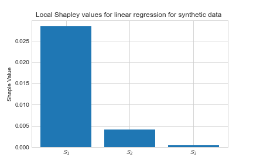

# Author Feedback to ICML '22 Paper #3404

Dear reviewers, many thanks for the feedback and constructive comments; they
greatly appreciate and help us learn and improve. Overall, the reviewers
appreciated the importance of the problem, the premise of the paper, and
the interest in the approach.

We are optimistic that our rebuttal can address each reviewer's concerns.

## General remark
This paper's primary focus is on a small to medium-sized tabular dataset—a
very common type of dataset in the average industry. For medium-scale tabular
data, non-deep learning-based models achieve SOTA results [1]. This can be made
more explicit, if accepted, in a camera-ready version.

[1] Borisov, Vadim, et al. "Deep neural networks and tabular data: A survey."
    arXiv preprint arXiv:2110.01889 (2021).

## Reviewer #1: Real-life example of non-deterioration
The first reviewer asked the following question:

> Can you provide a real-world example or motivating example where the
> distribution shifts but the model will not or does not deteriorate?

Our third experiment can be seen as an example of this case, wherein a random
feature gets shifted. A more realistic example of this phenomenon happens in
the house regression problem, where the age of the garage has an insignificant
effect on the price of the house. The age of a garage will naturally shift,
thus triggering monitoring systems based on distribution shift, but as no
performance drop happens, this is not an instance of model deterioration.

## Reviewer #4: Hyperparameters
The fourth reviewer states that we did not mention the hyperparameters used.
While this is correct, we did mention that we used the default hyperparameters
used in the scikit-learn library. To ensure that this is reproducible, we will
include the scikit-learn version that we used, as well as include a table with
all the hyperparameters in the appendix.

## Reviewer #1: Dataset Shift paper
The first reviewer mentioned Rabanser et al. [2] as a paper we need to compare
our method to. While being on the topic of distribution shift, the paper is
tackling a different problem, as they are focused on deep learning methods and
non-tabular datasets. The idea of monitoring the latent space is very
interesting, an approach that deserves further research. Unfortunately, non-DL
models do not have an easily accessible latent space. Also, the latent space
will require distributions, and we are monitoring models at the level of
individual predictions. We note that they also mention the Kolmogorov-Smirnov
test as a competing method in their statistical hypothesis testing section.

[2] Rabanser, Stephan, Stephan Günnemann, and Zachary Lipton. "Failing loudly:
    An empirical study of methods for detecting dataset shift." Advances in
    Neural Information Processing Systems 32 (2019).

## Reviewers #2, #3 and #4: Uncertainty estimation
The second, third, and fourth reviewer highlighted alternative uncertainty
estimation methods. However, to the best of our knowledge, there are no model
agnostic methods that allow us to estimate uncertainty besides those that we
compare our method with. Neither, on the application of uncertainty estimation to detect model deterioration.

## All reviewers: Performance and ablation studies
All reviewers asked about performance and/or ablation studies. We will add a
computational performance comparison to the appendix, along with other simple
ablation studies that can help to clarify the contributions.

## Appendix
We add a synthetic experiment to help to clarify the contribution.

### Synthetic data

For this case, we create a three-variate normal distributions $X = (X_1,X_2,X_3) \sim N(1,0.1\cdot I_3)$, where $I_3$ is an identity matrix of order three. The target variable is generated  $Y=X_1\cdot X_1 +  X_2 +   \epsilon$, with $\epsilon \sim N(0,0.1)$, to have a non linear feature, a linear feature and a non used feature. For both, training and test data, $10,000$ samples are drawn. Then out-of-distribution data is created by shifting $X$ by $\forall j \in \{1,2,3\}: X^{ood}_j = X^{tr}_j + 10$. 

We train a linear regression model $f_\theta$ on $\{X^{tr},Y^{tr}\}$, and calculate the uncertainty using Doubt (cf. Section XX). We then train another linear model $g_\theta$  on $\{X^{te},X^{ood}\}$ and the uncertainty estimates. The coeficcients of the linear model are $\beta_1= 0.0615,  \beta_2=0.0015 ,\beta_3= 0.004$

Since the features are independent and the used model is a linear regression we can calculate the interventional conditional expectation Shapley
values as $\phi_i(g_\theta, x) = \beta_i(x_i-\mu_i)$ [3]. 

So for the data point $x=\{10,10,10\}$. The Shapley values are $\phi_i(g_\theta, x)) = \{0.050,0.012,0.003\}$  The most relevant shifted feature in the model is the one that receives the highest Shapley value.

In this experiment with synthetic data, statistical testing on the input data would have flagged the three feature distributions as equally shifted. With our proposed method, we can identify the more meaningful features towards identifying the source of model predictive performance deterioration.

 [3]Chen, H., Janizek, J. D., Lundberg, S., & Lee, S. I. (2020). True to the Model or True to the Data?. arXiv preprint arXiv:2006.16234.

